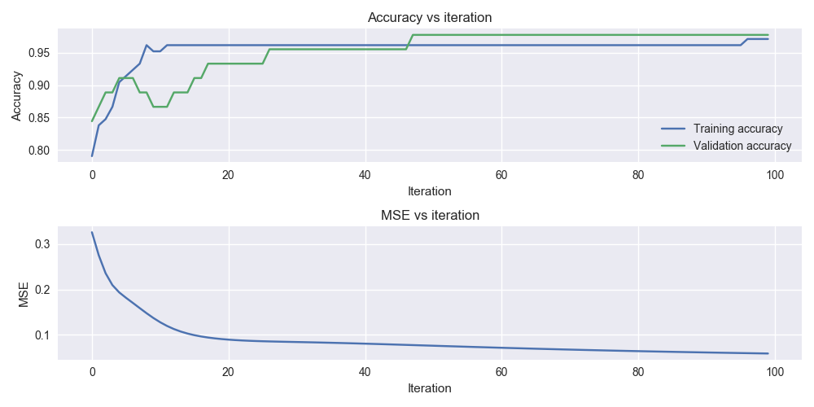
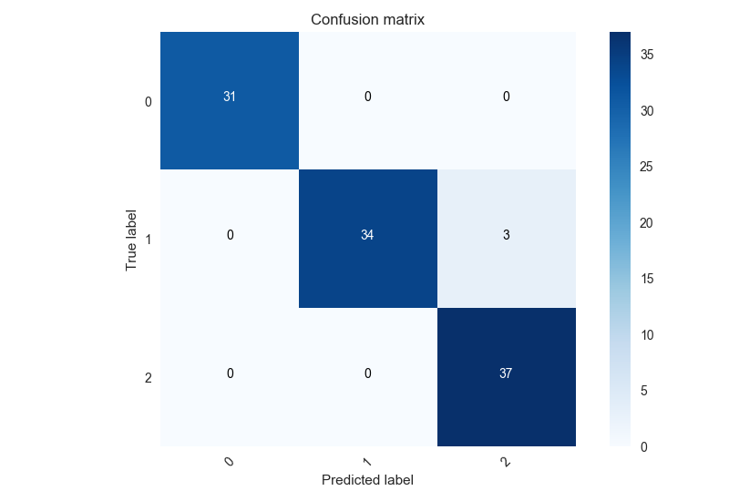

# Neural Network

The code in this folder implements a lot of functionality in order to train a Neural Network.

### DISCLAIMER

I am not a native english speaker so maybe you might find some spelling mistakes (sorry). I am trying to improve 
my english abilities, thanks for your patience.

Table of Contents
================

  * [Cloning the repository](#cloning)
  * [Usage](#usage)
    * [Example execution](#example-execution)
  * [Analysis](#analysis)
    * [Implementation](#implementation)
    * [The rocks in the way](#the-rocks-in-the-way)
    * [Results](#results)
  

Cloning the repository
===

To clone the repository please follow the next steps (you must have the git software in your system).

1) Choose a folder where the repository will be stored and go to it.
2) Run ``git clone https://github.com/rudyn2/cc5114.git``
3) Ready.

Usage
====

Creating your own neural network using this repository is really easy. If you have your data
ready you must create a "Neural Network" object, initialize it and then fit it and train it.

````
import src.neural_network.NeuralNetwork

# Creation of neural network architecture
nn = NeuralNetwork(architecture=[4, 15, 3], activation_function=['tanh', 'tanh'], learning_rate=0.1)

# Fit and train the neural network
nn.fit(X, y)
nn.train(100, verbose=True)
````

Example execution
---

In order to give to the first user a fast understanding of the code he can review the Example.py code available
in this folder. To execute it:

1) Open a terminal.
2) Change your directory to this folder.
3) Execute in the console: ``python Example.py``.
4) Ready.

The example will load the Iris Dataset and train a neural network using some of the tools that this
repository provides.

Architecture
---

The definition of the architecture is given by the input array "architecture" of the constructor. 
All the values have to be integers. The first value correspond to the number of inputs of the neural 
network. You need to be careful because this parameters will define your entire network.

The activation_function parameter can be a single string or a list of strings. If a single value is passed into
the net it will be occupied for all the neurons. At the moment the allowed activation functions are sigmoidal,
tanh and step functions.

Finally, the learning rate parameter gives you the freedom to control the scale of the updates of the
neural network in the learning procedure.

Analysis
===

Implementation
---

Talking about theory, the neural network implemented is a vanilla neural network with (until now) no much flexibility. 
The network uses the backpropagation algorithm which tries to minimize the (unique and default) mean squared error. Each
update is made after that 1 example is given to the network.

The implementation was made using object oriented programming (OOP) in order to allow easy extensibility of the code laying 
down the efficiency. At bird flight, the neural network is composed of neuron layers which at the time are composed of
neurons (minimum entity). The neural layer class implements a lot of important methods like the initialization of the
network parameters and updates of the weights and biases. The neuron class has methods to parsing the function 
activations names to objects, feeding and updating. The neural network contains the necessary code to implement
the backpropagation and train the neural network. It also has some methods for robustness and prediction. It's important
to say the neural network can fit training data, and both: training and validation data (using overloading). 

At the moment exists 3 different activation functions: sigmoid, tanh and step. They are implemented in OOP and just have
2 basic methods to obtain the evaluation of the function in a point and its derivative.

Other tools are also included in this repository. First, the metrics sub-package contains static methods
to perform one hot encoding, calculate confusion matrix, calculate losses, and similar. Also, exists a summary
class that uses the metrics functions and summaries the network results. Finally, in the preprocessing sub-package
are implementations to split datasets, normalize them and use k-fold validation (more info in the code docs).

The rocks in the way
---

The main source of errors was the implementation of the backpropagation algorithm. To say the truth, it is a really
tricky algorithm with a lot of little details to take in count. The backward step of the algorithm is complicated.
Also, the OOP implementation was a challenge in order to maintain the reliability of the code when more and more 
code was added. 

Results
---

I have used the Example script to perform some experiments with the neural network. First of all, i have trained
the neural network using the Iris Dataset from sklearn. The architecture used was 4 inputs, 15 neurons
in the hidden layer and 3 outputs for the output layer. Using this, the purpose of this is seeing the evolution of the 
loss and accuracy of the net along the training.



As we can see in the Learning Curve figure the accuracy of the neural network increase over the iterations. We have
to mention that each iteration correspond to a forward-backward step of the Backpropagation algorithm implemented
to train the network. Equally, the Mean Squared Error decreases as much as more iterations we have.  

The confusion matrix shows that the neural network efficiency is really high. The best accuracy for
the iris data set in the training segment is of 100% and for the validation data set of 98.08. The overall
accuracy is enough for this kind of application. In the testing data set, the network has a accuracy of 96.22%.



Given the results of the neural network in this data set we can say that it is over fitting the training data set.
To adjust this result you can reduce the amount of neurons, try different learning rates or maybe increase the amount
of data in order to increase the data variance. The reason of show this result and not other is demonstrate the
over fitting phenomenal. After all, the results are really good, just a few examples in the testing set are being
bad categorized.
  
